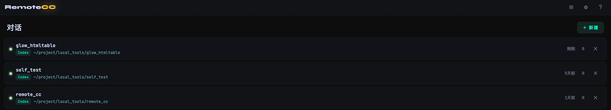
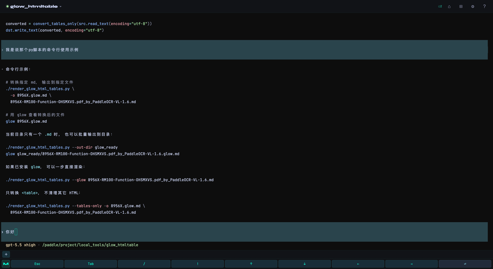
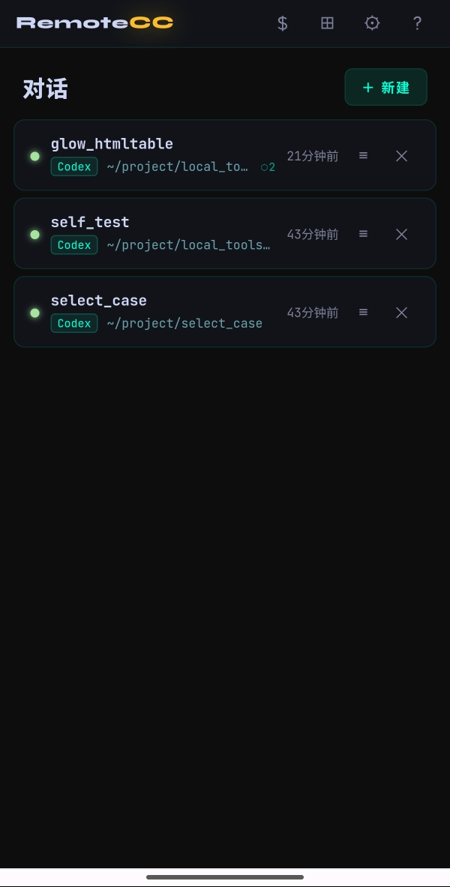
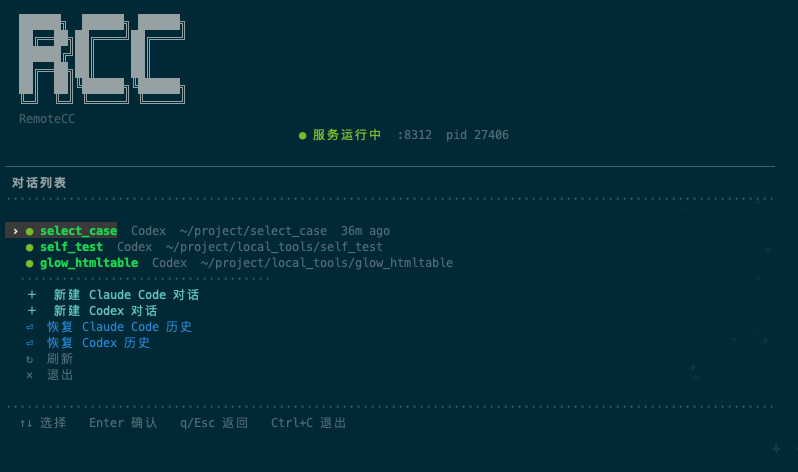

# AgentHub — AI Agent 多端协同管理平台

[English](README.en.md) | 中文

```
   █████╗ ██╗  ██╗██╗   ██╗██████╗
  ██╔══██╗██║  ██║██║   ██║██╔══██╗
  ███████║███████║██║   ██║██████╔╝
  ██╔══██║██╔══██║██║   ██║██╔══██╗
  ██║  ██║██║  ██║╚██████╔╝██████╔╝
  ╚═╝  ╚═╝╚═╝  ╚═╝ ╚═════╝ ╚═════╝
  AgentHub
```

> **欢迎提交 [Issue](https://github.com/Eureka520/agenthub/issues) 反馈 BUG 和建议。**

---

## 这是什么？

**把 Claude Code 和 Codex 从本地终端解放出来，躺在床上用手机也能和它们对话。**

Claude Code / Codex 都是跑在终端里的 AI 编程助手，功能强大，但只能在本机用。AgentHub 打通了这个限制——你的 Agent 会话可以同时从手机浏览器、平板、电脑终端访问，**所有端实时同步，真正共享同一个 PTY 进程**。

不是截图，不是日志，是**完全实时的双向同步**——你在手机上输入，电脑上看得到；你在终端里执行，手机上同步显示。任意断开任意端，Agent 在后台继续工作，随时重连、无缝恢复。

---

## 核心特性

- **真实终端** — 颜色、交互、鼠标全支持，和直接在本机用没有区别
- **实时多端同步** — 手机、平板、电脑同时接入同一个 Agent 会话
- **持久会话** — 关闭浏览器或断开 SSH，Agent 在后台继续跑，随时 reconnect
- **历史恢复** — 读取 Claude Code / Codex 历史，自动按工作目录恢复上次对话
- **目录式新建任务** — 新建会话时可从服务器目录树选择工作目录
- **文件浏览器** — 在 Web 端直接浏览服务器上的文件，预览代码/图片，复制路径
- **终端管理界面** — 在服务器上直接运行 `agenthub`，弹出可视化菜单管理所有会话
- **多端断开快捷键** — `Ctrl+]` 随时脱离当前会话回菜单，不终止 Agent
- **移动端优化** — 响应式 UI，手机上也能舒适操作
- **可定制外观** — 9 种 UI 风格、深/浅多套配色和多套图标风格，默认 Studio + Aurora + Material

---

## 上传文件 / 图片给 Agent

Web 端终端支持三种方式向 Claude Code 或 Codex 传递文件：

| 方式 | 操作 |
|------|------|
| 点击按钮选文件 | 手机端点击终端快捷栏上传按钮，选择任意文件或图片 |
| 拖拽 | 直接把文件拖到终端区域 |
| 粘贴图片 | 截图后 Ctrl+V 粘贴（自动上传） |

文件上传到服务器 `~/.agenthub/uploads/` 目录，路径自动填入终端光标位置，直接回车或继续输入 Agent 命令即可。

---

## 文件浏览器

点击顶栏文件夹图标打开文件浏览器，默认显示服务器根目录 `/`。

| 操作 | 说明 |
|------|------|
| 单击文件 | 右侧预览内容（代码含行号，图片直接显示） |
| 双击文件 | 全屏查看，手机上阅读更舒适 |
| 双击目录 | 进入目录 |
| 新建文件夹按钮 | 在当前目录创建子目录 |
| 复制路径按钮 | 复制文件/目录的绝对路径 |
| 上传 / 下载按钮 | 上传到当前目录 / 下载文件 |
| 拖拽文件 | 直接把文件拖到文件浏览器，上传到当前目录 |
| 路径输入框 | 直接输入路径跳转，回车确认 |

支持预览的文件类型：`.md` `.txt` `.py` `.js` `.ts` `.json` `.sh` `.yaml` 等代码和文本文件，以及常见图片格式（`png` `jpg` `gif` `webp`）。

设置页可以配置文件浏览器默认打开目录、临时 Shell 默认目录、新建会话默认目录，也支持修改 Web 登录密码。

---

## 临时 Shell

点击顶栏终端图标打开临时终端。它是普通 shell PTY，不进入 AgentHub 会话列表；浏览器断开或关闭该页面后进程会结束。默认优先使用 `zsh`，其次 `fish`、`bash`、`sh`；也可以用 `AHUB_SHELL` 或 `AHUB_SHELL` 指定。需要长期保持时，建议在里面使用 `tmux`。

---

## 多端实时同步原理

```
                     你打开了三个窗口
                            │
          ┌─────────────────┼─────────────────┐
          ▼                 ▼                 ▼
    手机浏览器          电脑浏览器         本地终端
    (WebSocket)       (WebSocket)      (Unix Socket)
          │                 │                 │
          └────────┬────────┘                 │
                   ▼                          │
             PTY Manager  ◀────────────────────┘
                   │
                   ▼
          Agent 进程（一直跑）
```

**任意端输入 → PTY stdin → 所有端同步看到输出**

这不是镜像或转发，而是多个订阅者共享同一个 PTY master fd。哪怕你把所有客户端都断开，Agent 还在后台继续执行任务。

---

## 快速开始

```bash
git clone https://github.com/Eureka520/agenthub.git
cd agenthub
bash install.sh
```

安装脚本全程交互，自动检测环境，无需手动配置。

AgentHub 会自动检测 Claude Code 和 Codex，至少安装其中一个即可。新建会话时可以选择 Agent；历史恢复支持 Claude Code 的 `~/.claude/projects/`，以及 Codex 的 `~/.codex/sessions/` 会话记录。

如果 Codex 或 Claude Code 需要代理，可在安装向导中配置 `CODEX_PROXY` / `CLAUDE_PROXY`。代理只注入对应 Agent CLI，不作为 AgentHub 全局代理；提示里的默认示例是 `http://127.0.0.1:7890`。

安装完成后：

```bash
agenthub start     # 启动服务
agenthub           # 弹出可视化菜单，管理会话
```

浏览器打开 `http://<服务器IP>:8310` 也可以使用。

---

## 常用命令

```bash
# 服务管理
agenthub start          # 启动服务（守护进程，崩溃自动重启）
agenthub stop           # 停止服务
agenthub restart        # 完整重启（更新后需要用）
agenthub reload         # 热重载（不断开正在进行的会话）
agenthub update         # 拉取最新版本，自动重启/热重载
agenthub status         # 查看服务是否在运行

# 日常使用（在服务器终端里运行）
agenthub                # 弹出可视化菜单，查看/进入/新建会话
agenthub attach <名称>  # 直接进入指定名称的会话
```

在任意会话内：**`Ctrl+]`** 退回菜单，不终止 Agent 进程。

---

## 更新日志

### 2026-06-03

- **Web 控制台增强**：新建会话支持目录选择；文件浏览器支持 `/` 根目录、新建文件夹、上传下载和路径复制
- **临时 Shell**：Web 顶栏新增不持久化的普通 shell 终端，默认优先使用 `zsh`
- **移动端终端**：快捷键栏仅在手机端显示，Shell 模式使用专用 shell 快捷键
- **外观与语言**：默认 Studio + Aurora + Material，支持 9 种 UI 风格、深/浅多套配色、6 种图标风格和完整中英文切换
- **设置持久化**：Web 设置保存到 `~/.agenthub/web-settings.json`，默认目录、主题、终端偏好和语言重启后仍然有效
- **TUI 断开修复**：修复 `ahub-tui` 新建会话后第一次 `Ctrl+]` 无法正常回菜单的问题

### 2026-05-21

- **Codex 历史恢复**：改为读取 `~/.codex/sessions/` 中的真实会话元数据，按工作目录分组，恢复时不再落到 `~`
- **恢复界面**：Web/TUI 的 Codex 历史按工作目录展示，不再多出 `~/.codex/history.jsonl` 这一层
- **移动端终端**：优化 xterm 异步写入后的锁底逻辑，减少 Codex 输出底部留白

### 2026-05-19

- **Codex 支持**：新建会话可选择 Claude Code 或 Codex，活跃会话会显示 Agent 类型
- **历史恢复**：支持从 Claude Code / Codex 历史中恢复历史对话
- **Agent 代理**：安装和更新流程支持 `CODEX_PROXY` / `CLAUDE_PROXY`，代理只注入对应 Agent CLI
- **服务管理**：修复 `ahub-tui` 服务状态误判，端口占用时 `ahub-server` 会显示占用进程

### 2026-05-12

- **文件浏览器**：Web 界面新增文件浏览功能，支持代码/图片预览、双击全屏、复制路径
- **热重载**：`agenthub reload` 仅重启业务层，不断开正在进行的 Agent 会话
- **agenthub update**：一键更新，自动判断是否需要重启
- **agenthub attach**：直接进入指定会话，断开后回到菜单而非退出终端
- **登录页跳转**：服务重启后浏览器自动跳回登录页，不再白屏

---

## 截图

| Web 会话列表 | Web 终端 |
|---|---|
|  |  |

| 移动端会话列表 | TUI 会话管理 |
|---|---|
|  |  |

---

## 文档

- [安装指南](docs/installation.md)
- [使用手册](docs/usage.md)
- [API 文档](docs/api.md)
- [架构说明](docs/architecture.md)
- [开发指南](docs/development.md)

---

## 参与贡献

这个工具还很年轻，欢迎：

- 🐛 [提交 BUG](https://github.com/Eureka520/agenthub/issues/new?labels=bug)
- 💡 [提功能建议](https://github.com/Eureka520/agenthub/issues/new?labels=enhancement)
- 🔧 提交 PR

---

## 许可证

[Apache 2.0](LICENSE) © 2026 changdazhou
