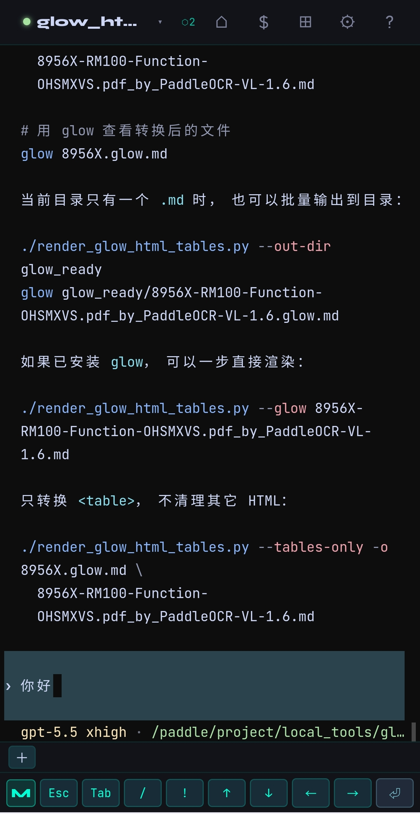
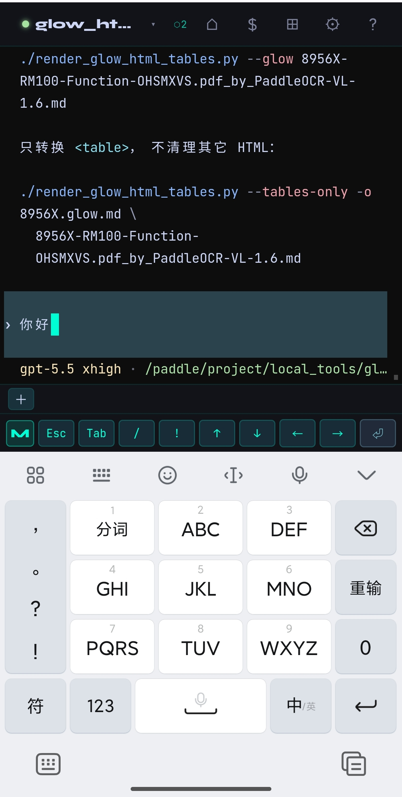
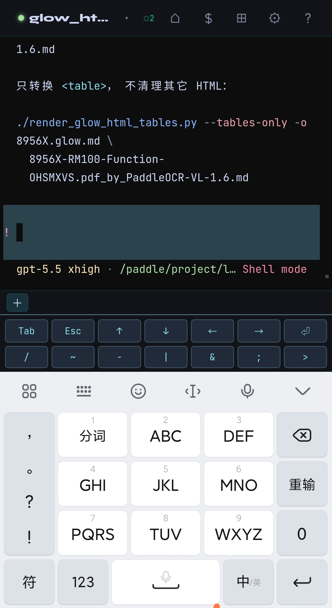
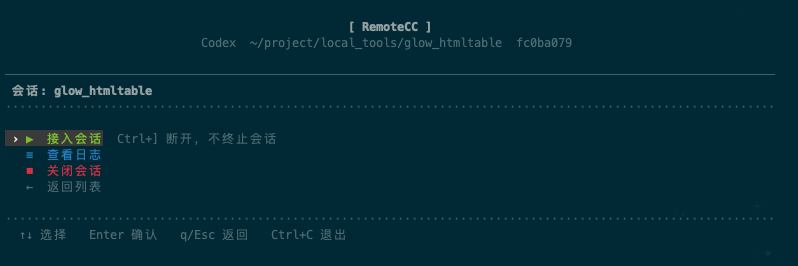

# 使用手册 / Usage Manual

[中文](#中文) | [English](#english)

---

## 中文

### 多端协同工作原理

AgentHub 的核心是**一个 PTY 进程，多个同步观察者**：

```
Agent PTY（持续运行）
        ├──▶ 浏览器 WebSocket（手机/平板/PC）
        ├──▶ ahub-tui（本地交互式 TUI）
        └──▶ agenthub attach（进入 TUI 接入会话）
```

无论从哪端输入，所有端实时可见。PTY 独立于客户端运行——关闭浏览器或断开 SSH，Agent 在后台继续工作。

---

### Web 界面

浏览器访问 `http://<server>:8310` 登录后使用。

#### 对话列表（首页）

| 元素 | 说明 |
|------|------|
| 绿点 ● | 会话运行中 |
| 灰点 ○ | 会话已结束（5秒后自动移除） |
| 会话名 | 默认为目录名，双击可改名 |
| 时间 | 最后活跃时间 |
| `≡` | 查看日志 |
| `✕` | 关闭/删除会话 |

#### 新建对话

- **New 标签**：选择 Claude Code 或 Codex，输入工作目录或点击目录按钮选择工作目录，填写会话名 → 启动
- **Resume 标签**：从 Claude Code / Codex 历史中按工作目录选择对话 → 恢复
- **代理**：安装时可配置 `CODEX_PROXY` / `CLAUDE_PROXY`；代理只用于 Agent CLI，不会作为 AgentHub 全局代理。

#### 终端操作

| 快捷键 | 功能 |
|--------|------|
| Shift+Tab | 切换 Claude 内部模式（Plan/Auto/Act） |
| Ctrl+Shift+C | 复制选中内容 |
| Ctrl+Shift+V | 粘贴 |
| 右键 | 上下文菜单（Copy/Paste/Clear） |

#### 符号快捷键栏

- 快捷键栏只在手机端显示，PC 端保留完整终端区域。
- **CC 模式**（蓝色）：`M`（Shift+Tab）`Esc` `Tab` `/` `!` `↑↓←→` `⏎`
- **SH 模式**（黄色，行首输入 `!` 自动切换）：两排 Linux 常用符号；临时 Shell 终端始终使用 Shell 快捷键
- `Ctrl+]` 在会话内断开回菜单

#### 文件浏览器（右上角文件夹图标）

点击顶栏文件夹图标打开文件浏览器，默认显示服务器根目录 `/`：

- **左栏**：目录浏览，双击进入子目录，支持隐藏文件显示
- **右栏**：文件预览（文本/代码含行号、图片）
- **新建文件夹**：点击工具栏文件夹加号，在当前目录创建子目录
- **复制路径**：鼠标悬停条目，点击复制路径按钮；预览面板顶部也有复制按钮
- **上传 / 下载**：点击上传按钮或把文件拖到文件浏览器，可上传到当前目录；点击下载按钮下载文件

#### 临时 Shell（右上角终端图标）

终端按钮会打开一个不持久化的普通 shell PTY，适合短任务。关闭页面或浏览器后 shell 会退出。默认优先使用 `zsh`，其次 `fish`、`bash`、`sh`；可通过 `AHUB_SHELL` 或 `AHUB_SHELL` 指定。需要保持时在 shell 内使用 `tmux`。

#### 设置页（右上角设置图标）

- **外观**：9 种 UI 风格，深色 12 套 / 浅色 9 套颜色主题，6 种图标风格；默认 Studio + Aurora + Material
- **终端**：字体（含 MesloLGS NF 系列）/字号/行高/光标/回滚行数/符号栏
- **连接**：重连延迟
- **远程控制**：文件浏览器默认目录、临时 Shell 默认目录、新建会话默认目录
- **账户**：查看当前用户、修改 Web 登录密码、退出登录
- **语言**：中文 / English；设置页、帮助页、说明文案和图标提示会同步切换

---

### 命令行工具

#### agenthub

统一管理入口：

```bash
agenthub                   # 进入 TUI 界面
agenthub attach            # 进入 TUI 界面
agenthub attach <name>     # 直接在 TUI 内接入指定会话
agenthub ls                # 列出所有会话
agenthub log <name>        # 实时查看会话日志（tail -f）
```

**断开方式**：`Ctrl+]`（不终止 PTY）

#### ahub-tui（推荐）

本地交互式 TUI，无需登录，直接通过 Unix Socket 连接：

```bash
ahub-tui
```

启动后显示大字 banner 和会话列表。`ahub-tui` 会读取 `~/.agenthub/server.lock` 和项目 `.env` 来判断服务端口；如果端口被其他进程占用，`ahub-server status` 会显示占用者：

```
  ██████╗  ██████╗ ██████╗
  ...
  ● 服务运行中  :8310

  对话列表
  ─────────────────────────
   › ● my-project  ~/project  3m ago
     ＋  新建对话
     ⏎  恢复历史对话
     ✕  退出
```

**键盘操作**：

| 按键 | 功能 |
|------|------|
| `↑` / `↓` | 移动光标 |
| `Enter` | 确认/进入 |
| `q` / `Esc` | 返回上一页 |
| `Ctrl+C` | 退出 ahub-tui |
| **`Ctrl+]`** | **在会话内断开，返回菜单** |

---

### 截图

#### Web

| 会话列表 | 终端 |
|---|---|
|  |  |

#### 移动端

| 会话列表 | 终端 | 输入法联动 | Shell 快捷键 |
|---|---|---|---|
|  |  |  |  |

#### TUI

| 会话列表 | 会话操作 |
|---|---|
|  |  |

---

### URL 路由

| URL | 说明 |
|-----|------|
| `/#/` | 首页 |
| `/#/new` | 新建对话 |
| `/#/session/:id` | 打开指定会话 |
| `/#/settings` | 设置页 |

---

## English

### How Multi-Client Sync Works

AgentHub's core is **one PTY process, multiple synchronized observers**:

```
Agent PTY (always running)
        ├──▶ Browser WebSocket (phone/tablet/PC)
        ├──▶ ahub-tui (local interactive TUI)
        └──▶ agenthub attach (enter TUI to attach session)
```

Input from any client is visible to all others in real time. The PTY runs independently — closing the browser or dropping SSH does not interrupt the agent.

---

### Web Interface

Open `http://<server>:8310` in a browser and log in.

#### Conversation List (Home)

| Element | Description |
|---------|-------------|
| Green ● | Session running |
| Gray ○ | Session ended (auto-removed after 5s) |
| Session name | Defaults to directory name; double-click to rename |
| Time | Last active time |
| `≡` | View log |
| `✕` | Close/delete session |

#### New Conversation

- **New tab**: Choose Claude Code or Codex, enter a working directory or pick one from the directory picker, enter a session name → start
- **Resume tab**: Browse Claude Code / Codex history grouped by working directory → resume
- **Proxy**: Configure `CODEX_PROXY` / `CLAUDE_PROXY` during installation; proxy variables are scoped to the agent CLI and are not global AgentHub proxy settings.

#### Terminal Shortcuts

| Shortcut | Function |
|----------|----------|
| Shift+Tab | Switch Claude mode (Plan/Auto/Act) |
| Ctrl+Shift+C | Copy selection |
| Ctrl+Shift+V | Paste |
| Right-click | Context menu (Copy/Paste/Clear) |

#### Symbol Bar

- The shortcut bar is shown only on mobile; desktop keeps the full terminal area.
- **CC mode** (blue): `M`(Shift+Tab) `Esc` `Tab` `/` `!` `↑↓←→` `⏎`
- **SH mode** (yellow, auto-switch when `!` is first char): two rows of Linux symbols; the temporary Shell terminal always uses shell shortcuts
- `Ctrl+]` detaches from session back to menu

#### File Browser (folder icon, top right)

Click the folder icon to open the file browser, which defaults to the server root directory `/`:

- **Left panel**: directory listing, double-click to enter, toggle hidden files
- **Right panel**: file preview (text/code with line numbers, images)
- **New folder**: click the folder-plus tool button to create a subdirectory in the current directory
- **Copy path**: hover over an entry and click the copy path button; also available in the preview header
- **Upload / download**: click the upload button or drop files onto the browser to upload into the current directory; click the download button to download files

#### Temporary Shell (terminal icon, top right)

The terminal button opens a non-persistent shell PTY. It is useful for short terminal-only tasks; close the page or browser and the shell exits. It prefers `zsh`, then `fish`, `bash`, and `sh`; set `AHUB_SHELL` or `AHUB_SHELL` to override it. Use `tmux` inside the shell when persistence is needed.

#### Settings (settings icon, top right)

- **Appearance**: 9 UI styles, 12 dark and 9 light color themes, 6 icon styles; defaults to Studio + Aurora + Material
- **Terminal**: font (including MesloLGS NF family) / size / line-height / cursor / scrollback / symbol bar
- **Connection**: reconnect delays
- **Remote control**: file browser default path, temporary shell cwd, new-session default directory
- **Account**: current user, Web login password change, sign out
- **Language**: 中文 / English; settings, help, descriptions, and icon tooltips switch together

Web settings are stored on the server in `~/.agenthub/web-settings.json`, so default directories, themes, terminal preferences, and language survive AgentHub restarts. Existing browser `localStorage` settings are migrated automatically the first time the backend settings file does not exist.

---

### CLI Tools

#### agenthub

Unified management entry point:

```bash
agenthub                   # Open TUI
agenthub attach            # Open TUI
agenthub attach <name>     # Open TUI and attach to named session directly
agenthub ls                # List all sessions
agenthub log <name>        # tail -f session log
```

**Detach**: `Ctrl+]` (does not kill the PTY)

#### ahub-tui (Recommended)

Local interactive TUI — no login required, connects directly via Unix Socket:

```bash
ahub-tui
```

Displays a large-text banner and session list on launch. `ahub-tui` reads `~/.agenthub/server.lock` and the project `.env` to detect the service port; if another process occupies the port, `ahub-server status` shows the owner:

```
  ██████╗  ██████╗ ██████╗
  ...
  ● Service running  :8310

  Conversation List
  ─────────────────────────
   › ● my-project  ~/project  3m ago
     ＋  New conversation
     ⏎  Resume history
     ✕  Exit
```

**Keyboard**:

| Key | Action |
|-----|--------|
| `↑` / `↓` | Move cursor |
| `Enter` | Confirm / enter |
| `q` / `Esc` | Back to previous page |
| `Ctrl+C` | Quit ahub-tui |
| **`Ctrl+]`** | **Detach from session, back to menu** |

---

### Screenshots

#### Web

| Sessions | Terminal |
|---|---|
|  |  |

#### Mobile

| Sessions | Terminal | Keyboard input | Shell shortcuts |
|---|---|---|---|
|  |  |  |  |

#### TUI

| Session list | Session actions |
|---|---|
|  |  |

---

### URL Routes

| URL | Description |
|-----|-------------|
| `/#/` | Home |
| `/#/new` | New conversation |
| `/#/session/:id` | Open specific session |
| `/#/settings` | Settings |

---

## 更新记录 / Changelog

### 2026-06-03

**TUI 断开修复**：修复 `ahub-tui` 新建会话后第一次 `Ctrl+]` 无法正常回菜单的问题。

**新建任务目录选择**：Web 新建会话支持通过目录选择器挑选工作目录。

**文件浏览器**：默认从 `/` 打开，支持新建文件夹、点击/拖拽上传到当前目录和下载文件。

**临时 Shell**：Web 顶栏新增通用终端入口，提供不持久化的普通 shell 终端；需要保持时建议使用 `tmux`。

**图标与主题**：Web 顶栏、文件管理器、设置页和操作按钮使用统一 SVG 图标系统；默认 Material 风格，支持 6 种图标风格、9 种 UI 风格、深色 12 套 / 浅色 9 套配色。

**设置增强**：设置页支持默认目录配置和 Web 登录密码修改。

**设置持久化**：Web 设置会保存到后端 `~/.agenthub/web-settings.json`，默认目录、主题、终端偏好和语言在 AgentHub 重启后仍然有效。

**帮助文档**：帮助页支持中英文切换和内嵌截图展示，移动端使用左侧章节抽屉。

### 2026-05-21

**Codex 历史恢复**：恢复列表改为读取 `~/.codex/sessions/` 中的真实会话元数据，按工作目录分组；恢复时会使用原始 cwd，不再退回 `~`。

**恢复界面**：Web/TUI 的 Codex 历史按工作目录展示，去掉 `~/.codex/history.jsonl` 这一层无意义容器。

**移动端终端**：优化 xterm 异步写入后的自动锁底和用户滚动识别，减少 Codex 输出底部留白。

### 2026-05-19

**Codex Agent**：新建会话支持选择 Claude Code 或 Codex；Web、TUI 和会话列表都会保留并展示 Agent 类型。

**历史恢复**：Claude Code 继续读取 `~/.claude/projects/`，Codex 支持恢复历史对话。

**Agent 代理**：安装和 `agenthub update` 可补充 `CODEX_PROXY` / `CLAUDE_PROXY`；代理只注入 Agent CLI，不作为 AgentHub 全局代理。

**服务状态**：`ahub-tui` 改进服务检测；`ahub-server status/start` 在端口被占用时显示占用进程。

### 2026-05-12

**文件浏览器**：Web 界面新增文件浏览功能。顶栏点击 ⊞ 打开，支持目录导航、文本/图片预览、复制路径、一键 cd 到终端。

**热重载架构**：服务拆分为 proxy.js（常驻）和 app.js（可热重启）。执行 `ahub-server reload` 仅重启业务层，WS 连接和 Agent 会话不中断。

**ahub-server 命令**：

| 命令 | 说明 |
|------|------|
| `ahub-server reload` | 热重载（改了 app.js 层代码用此命令，不断会话） |
| `ahub-server restart` | 完整重启（改了 proxy.js/auth.js 等核心文件用此命令） |

---

## License / 许可证

Apache 2.0 — see [LICENSE](../LICENSE)
